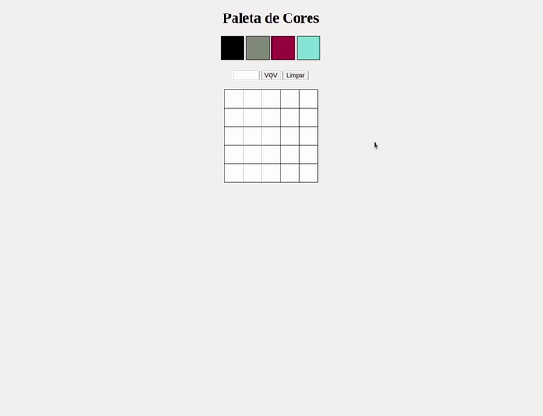

<h1 align="center">Project Pixels Art</h1>

<p align="center">✅ Concluded</p>

## 💻 Instalando o projeto

Clone o repositório:

```
git clone git@github.com:lramos33/project-pixels-art.git
```

Acesse a pasta do repositório

```
cd project-pixels-art
```

Execute o arquivo index.html

## 🚀 Habilidades

- Manipular o DOM;
- Manipular o Javascript.

## 🔧 Desenvolvimento

Neste projeto foi implementado uma página web que contém uma paleta de cores funcional que pode ser utilizada para criar desenhos em pixels. Para isto, foi utilizado apenas `html`, `css` e `javascript`.



## 📝 Requisitos do projeto

- [x] 1. Adicione à página o título "Paleta de Cores";

- [x] 2. Adicione à página uma paleta de quatro cores distintas;

- [x] 3. Adicione a cor preta como a primeira cor da paleta de cores;

- [x] 4. Adicione à página um quadro de pixels, com 25 pixels;

- [x] 5. Faça com que cada elemento do quadro de pixels possua 40 pixels de largura, 40 pixels de altura e seja delimitado por uma borda preta de 1 pixel;

- [x] 6. Defina a cor preta como cor inicial. Ao carregar a página, a cor preta já deve estar selecionada para pintar os pixels;

- [x] 7. Clicar em uma das cores da paleta faz com que ela seja selecionada e utilizada para preencher os pixels no quadro;

- [x] 8. Clicar em um pixel dentro do quadro após selecionar uma cor na paleta faz com que o pixel seja preenchido com a cor selecionada;

- [x] 9. Crie um botão que, ao ser clicado, limpa o quadro preenchendo a cor de todos seus pixels com branco.

### Requisitos bônus:

- [x] 10. Faça o quadro de pixels ter seu tamanho definido pela pessoa usuária;

- [x] 11. Limite o tamanho mínimo e máximo do board;

- [x] 12. Faça com que as cores da paleta sejam geradas aleatoriamente ao carregar a página.

##

<div align="center">
  
  
  
</div>
